# Vehicle Detection

In this project, our goal is to write a software pipeline to detect vehicles in a video provided by Udacity. 

## Pipeline
* Train a SVM classfier by extracting spatial features, color features and Histogram of gradients from the labeled training data set.
* Implement a sliding-window technique and use a trained classifier to predict vehicles in small patches of an image.
* Run the pipeline on a video stream (start with the test_video.mp4 and later implement on full project_video.mp4) and create a heat map 
  of recurring detections frame by frame to reject outliers and track detected vehicles.
* Draw the bounding on the detected vehicles
* Additionally I have integrated the Advance lane line detection pipeline to detect lane lines in the video. Advance Lane lines detection project can be found
  [here](https://github.com/akashchavan15/CarND-Advanced-Lane-Lines)
  
### Data Exploration
I began by loading all of the vehicle and non-vehicle image paths from the provided dataset. The figure below shows a random sample of image 
from both classes of the dataset.  
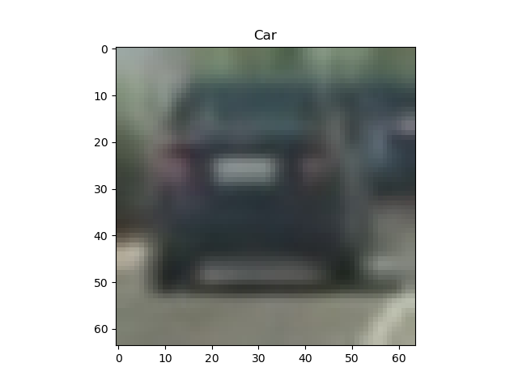 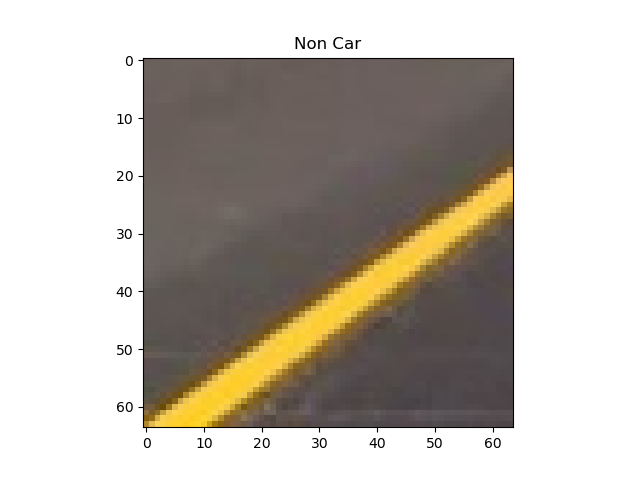

### Feature Extraction
#### Color Histogram
RGB image is first converted into YCrCb color space and the color histogram is computed for each color channel for both Car image and Non Car image.
These histogram features then added to final feature vector.  
 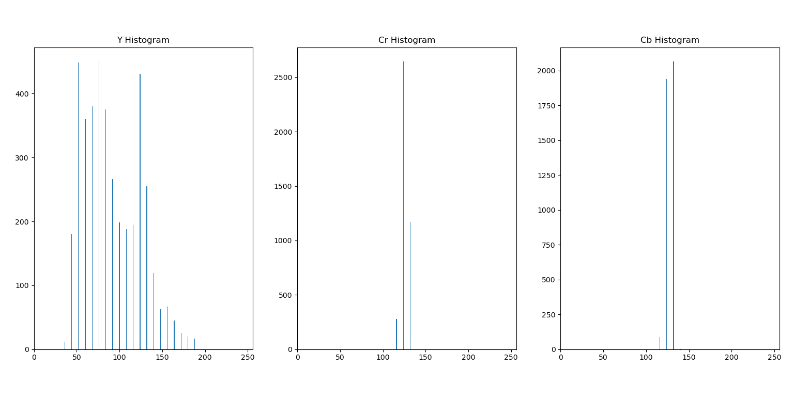  
 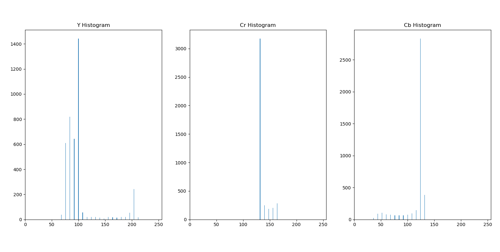

#### Spatial Binning
Spatial Binning is applied to each image with the size of 32 * 32. The resultant feature vector goes into final feature vector.  
 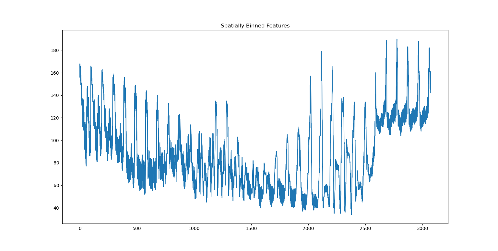  
 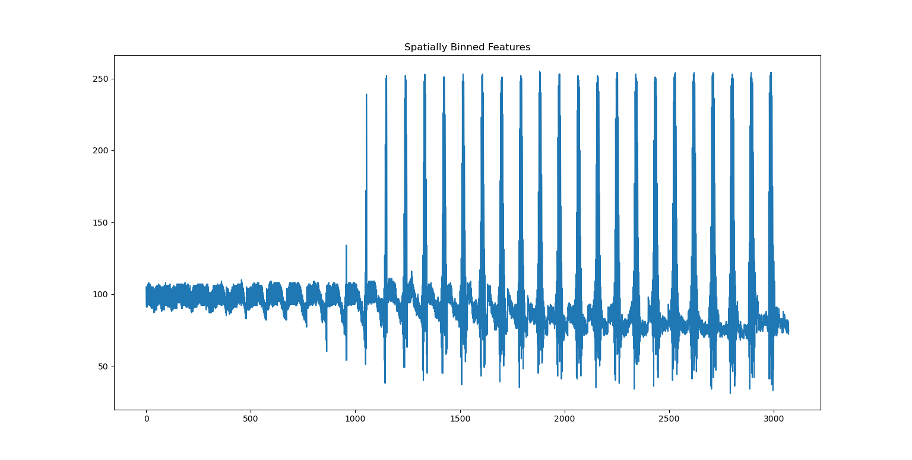

#### HOG
By doing trying different combinations of parameters, finally I came up with following parameters for HOG feature computation.   

| Parameter     | Value         |
| ------------- |:-------------:| 
| Color Space   | YCrCb         |
| HOG Orient    | 9             |   
| HOG Pixels per cell | 8       |  
| HOG Cell per block |2       |  
| HOG Channels | All       | 
| Spatial bin size | (32,32)       | 
| Histogram bins| 32       | 
| Histogram range| (0,256)       | 

 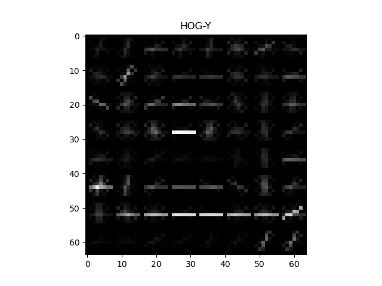  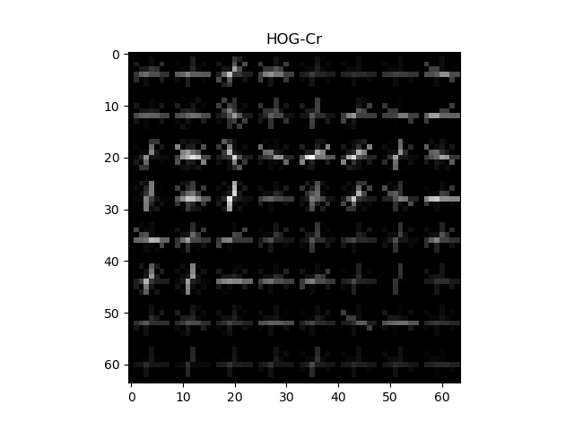 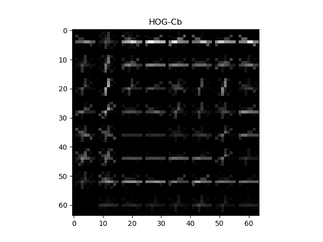  
 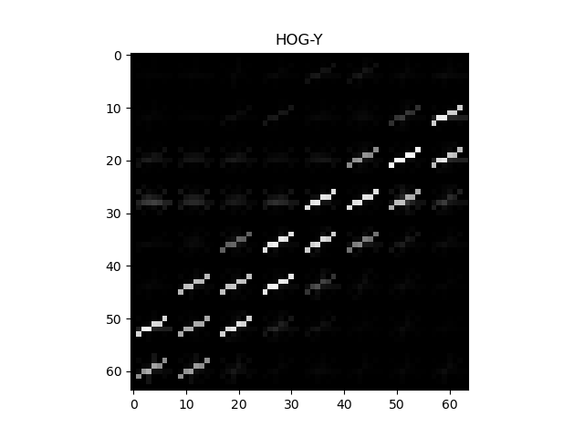  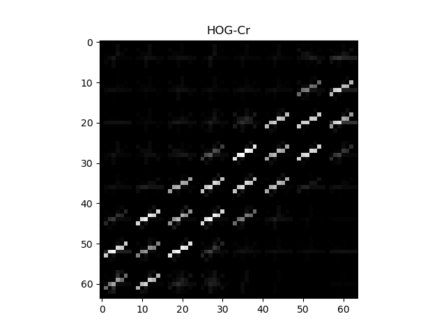   

### Training Classifier
I used LinearSVC classifier with StandardScaler. Total number of vehicle images and non vehicle images in dataset were 8917 and 8968. Twenty percent of 
the data set was reserved as test data set. Since the number of positive and negative images were almost equal, there was no issue of data sparcity. Classifier accuracy on test dataset was was 99.16 % and it took 2.98 seconds to train.

### Sliding Window Search
Normally, when we do the sliding window search, we slide the window over the entire image and find the interested objects. But here, we already know that vehicle is going
to be in the bottom half of the image. So, I chose to do the sliding window search in the bottom half of the image. A patch of image is extracted depending upon different 
start and stop positions of the image height and is used for HOG feature extraction. The HOG features are extracted for a selected portion of image and then these features are subsampled according to the size of the window and added to feature vector. For Spatial features and Color Histogram features a small portion of patched image is taken using the window size and it's features are computed. Finally, all the features are stacked and fed to the classifier for classification. 
If the classifier classifies the window as containing the vehicle, then a new entry is added into the 'rectagles' list to draw the boxes later. Because a true positive is typically found by several window search, while false positives are typically detected by only one or two searches, a combined heatmap and threshold is used to differentiate the two. At the end, a label function is used from Scipy library to find the vehicles we are looking for. 
